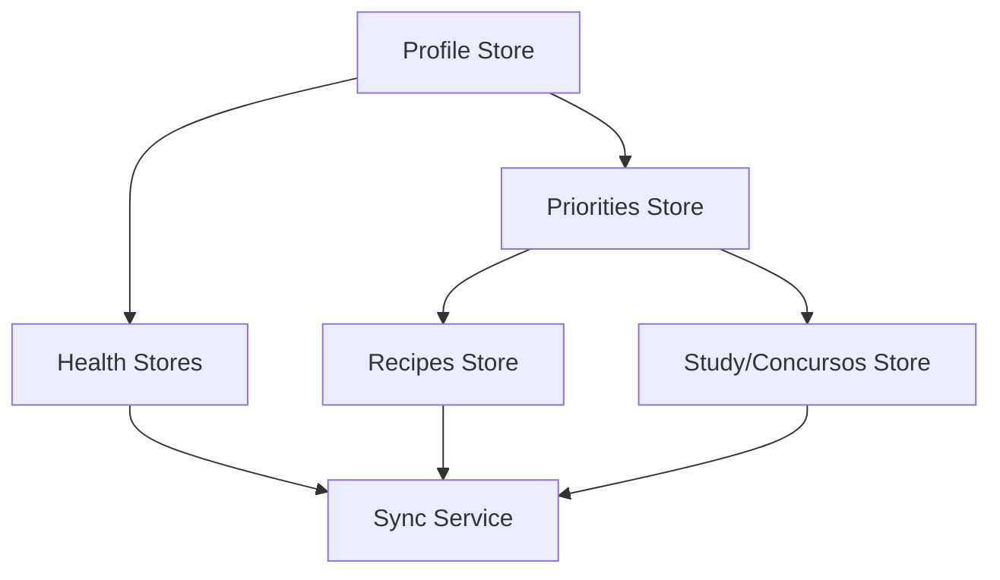
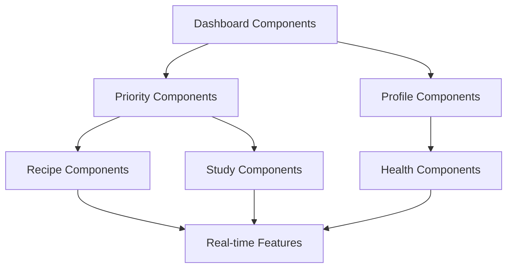

# StayFocus Supabase Refactoring - Implementation Guide

## Overview

This guide provides a comprehensive roadmap for implementing the Supabase refactoring of the StayFocus project using the systematic prompt templates. It includes dependency matrices, implementation order, and validation checkpoints.

## Implementation Phases

### Phase 1: Foundation Setup (Days 1-3)
**Objective**: Establish Supabase infrastructure and authentication

#### Tasks:
1. **Infrastructure Setup** (Prompt 1)
   - Install Supabase dependencies
   - Configure environment variables
   - Set up client/server structure
   - Create base folder architecture

2. **Database Schema Design** (Prompt 2)
   - Design complete database schema
   - Implement RLS policies
   - Create indexes for performance
   - Generate TypeScript types

3. **Authentication Layer** (Prompt 3)
   - Implement auth store
   - Create middleware for protected routes
   - Set up session management
   - Add offline mode support

#### Validation Checkpoints:
- [ ] Supabase client connects successfully
- [ ] Database schema created and accessible
- [ ] Authentication flow works end-to-end
- [ ] TypeScript types generated correctly

---

### Phase 2: Core Store Migration (Days 4-8)
**Objective**: Migrate all Zustand stores to Supabase integration

#### Implementation Order:

#### Tasks:
1. **Profile Store Migration** (Prompt 4A)
   - Migrate user preferences and settings
   - Implement avatar upload
   - Add guest mode support

2. **Priorities Store Migration** (Prompt 4B)
   - Migrate daily task management
   - Add real-time synchronization
   - Implement optimistic updates

3. **Health Stores Migration** (Prompt 4E)
   - Migrate medication, mood, and sleep tracking
   - Enhance privacy and security
   - Add health analytics

4. **Recipes Store Migration** (Prompt 4C)
   - Migrate recipe management
   - Implement image storage
   - Add search and filtering

5. **Study/Concursos Store Migration** (Prompt 4D)
   - Migrate exam and study management
   - Add progress tracking
   - Implement study analytics

#### Validation Checkpoints:
- [ ] Each store maintains API compatibility
- [ ] Data migration scripts work correctly
- [ ] Real-time subscriptions function properly
- [ ] Offline functionality preserved

---

### Phase 3: Synchronization Layer (Days 9-11)
**Objective**: Implement comprehensive sync service and conflict resolution

#### Tasks:
1. **Sync Service Implementation** (Prompt 5)
   - Create centralized sync coordinator
   - Implement conflict resolution algorithms
   - Add offline queue management
   - Set up batch synchronization

2. **Real-time Features** (Prompt 7)
   - Implement real-time subscriptions
   - Add connection state management
   - Optimize subscription performance
   - Handle reconnection scenarios

#### Validation Checkpoints:
- [ ] Sync service coordinates all stores
- [ ] Conflict resolution works correctly
- [ ] Real-time updates propagate properly
- [ ] Offline queue processes successfully

---

### Phase 4: Component Refactoring (Days 12-16)
**Objective**: Update all components to work with Supabase-integrated stores

#### Implementation Order:

#### Tasks:
1. **Dashboard Components** (Prompt 6A)
   - Update main dashboard
   - Add sync status indicators
   - Implement loading states

2. **Priority Management Components** (Prompt 6B)
   - Add optimistic updates
   - Implement real-time task sync
   - Handle conflict resolution UI

3. **Recipe Management Components** (Prompt 6C)
   - Integrate image upload
   - Add enhanced search
   - Implement real-time recipe sharing

4. **Study Management Components** (Prompt 6D)
   - Add progress synchronization
   - Implement study analytics
   - Create session tracking

#### Validation Checkpoints:
- [ ] All components work with new stores
- [ ] UI/UX remains unchanged
- [ ] Real-time updates display correctly
- [ ] Optimistic updates function properly

---

### Phase 5: Offline Support & Optimization (Days 17-20)
**Objective**: Implement robust offline support and performance optimization

#### Tasks:
1. **Offline Support Implementation** (Prompt 8)
   - Create offline operation manager
   - Implement data integrity validation
   - Add conflict resolution UI
   - Optimize sync on reconnection

2. **Performance Optimization** (Prompt 9)
   - Optimize database queries
   - Implement intelligent caching
   - Reduce bundle size
   - Optimize memory usage

#### Validation Checkpoints:
- [ ] App works completely offline
- [ ] Sync performance meets targets
- [ ] Memory usage optimized
- [ ] Bundle size reduced

---

### Phase 6: Testing & Documentation (Days 21-23)
**Objective**: Comprehensive testing and documentation

#### Tasks:
1. **Testing Implementation** (Prompt 10)
   - Create unit tests for stores
   - Add integration tests
   - Implement E2E tests
   - Performance testing

2. **Documentation & Migration**
   - Document new architecture
   - Create troubleshooting guides
   - Prepare migration scripts
   - User communication plan

#### Validation Checkpoints:
- [ ] All tests pass
- [ ] Performance targets met
- [ ] Documentation complete
- [ ] Migration plan validated

---

## Dependency Matrix

### Store Dependencies
| Store | Depends On | Required For |
|-------|------------|--------------|
| Profile | Auth Layer | All other stores |
| Priorities | Profile | Dashboard, Study |
| Health | Profile | Dashboard |
| Recipes | Profile | Meal planning |
| Study/Concursos | Profile, Priorities | Study tracking |
| Sync Service | All stores | Real-time features |

### Component Dependencies
| Component | Store Dependencies | Other Components |
|-----------|-------------------|------------------|
| Dashboard | Profile, Priorities, Health | All dashboard sub-components |
| Priority Management | Priorities | Dashboard |
| Recipe Management | Recipes | Shopping list |
| Study Management | Study/Concursos, Priorities | Progress tracking |
| Health Tracking | Health | Dashboard |

---

## Risk Mitigation Strategies

### High-Risk Areas:
1. **Data Migration**: Risk of data loss during store migration
   - **Mitigation**: Comprehensive backup strategy, gradual migration
   
2. **Real-time Performance**: Risk of poor performance with many subscriptions
   - **Mitigation**: Subscription optimization, connection pooling
   
3. **Offline Conflicts**: Risk of complex conflict scenarios
   - **Mitigation**: Clear conflict resolution strategies, user choice options
   
4. **Authentication Issues**: Risk of user lockout or data access problems
   - **Mitigation**: Guest mode fallback, robust session management

### Rollback Strategy:
- Maintain feature flags for gradual rollout
- Keep original stores as fallback during transition
- Implement data export/import for emergency recovery
- Monitor performance metrics continuously

---

## Quality Assurance Checklist

### Functional Requirements:
- [ ] All existing features work identically
- [ ] Real-time synchronization functions correctly
- [ ] Offline mode works without internet
- [ ] Data integrity maintained across devices
- [ ] Authentication flow is seamless
- [ ] Performance meets or exceeds current benchmarks

### Non-Functional Requirements:
- [ ] Security policies properly implemented
- [ ] Privacy requirements met (especially health data)
- [ ] Accessibility features preserved
- [ ] Mobile responsiveness maintained
- [ ] Browser compatibility verified
- [ ] Error handling comprehensive

### User Experience:
- [ ] No disruption to existing workflows
- [ ] Loading states provide clear feedback
- [ ] Sync status clearly communicated
- [ ] Error messages are user-friendly
- [ ] Offline/online transitions are smooth
- [ ] Performance feels responsive

---

## Success Metrics

### Technical Metrics:
- **Sync Latency**: < 500ms for real-time updates
- **Offline Capability**: 100% functionality without internet
- **Data Consistency**: 99.9% across all devices
- **Performance**: No degradation from current benchmarks
- **Reliability**: 99.9% uptime for sync services

### User Experience Metrics:
- **Feature Parity**: 100% of existing features maintained
- **User Satisfaction**: No decrease in user satisfaction scores
- **Error Rate**: < 0.1% for sync operations
- **Adoption Rate**: Seamless transition for existing users
- **Support Tickets**: No increase in support requests

---

## Post-Implementation Monitoring

### Week 1-2: Intensive Monitoring
- Monitor all sync operations
- Track error rates and performance
- Gather user feedback
- Address critical issues immediately

### Month 1: Stability Assessment
- Analyze performance trends
- Optimize based on usage patterns
- Document lessons learned
- Plan future enhancements

### Ongoing: Continuous Improvement
- Regular performance reviews
- User feedback integration
- Feature enhancement planning
- Security audit updates

---

## Conclusion

This implementation guide provides a systematic approach to refactoring StayFocus with Supabase integration. By following the phased approach and using the detailed prompt templates, the development team can ensure a successful migration that maintains the excellent user experience while adding powerful new capabilities for data synchronization and collaboration.

The key to success is maintaining backward compatibility throughout the process, implementing comprehensive testing at each phase, and having robust rollback strategies in place. The modular approach allows for gradual implementation and validation, reducing risk while ensuring quality outcomes.
