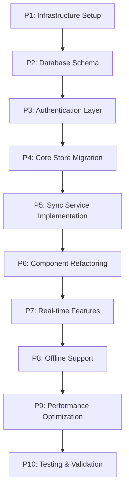

# StayFocus Supabase Refactoring - Systematic Prompt Templates

## Overview

This document provides a sequence of interdependent prompt templates for systematically refactoring the StayFocus project to implement Supabase integration. Each prompt builds upon the previous ones and follows the technical specifications outlined in the Supabase-NextJS integration report.

## Prerequisites

Before starting the refactoring process, ensure you have:
1. Supabase project created with database URL and anon key
2. Understanding of the current Zustand store architecture
3. Access to the technical reports for reference
4. Current codebase context available

## Prompt Sequence Overview



## Template Variables

Each prompt template uses these contextual variables:
- `{STORE_NAME}`: Name of the specific store being refactored
- `{COMPONENT_NAME}`: Name of the component being updated
- `{PAGE_PATH}`: Path to the page being refactored
- `{CURRENT_CODE}`: Current implementation code
- `{DEPENDENCIES}`: Related stores/components that need coordination

---

## PROMPT 1: Infrastructure Setup and Configuration

### Role Definition
You are a senior full-stack developer specializing in Supabase integration with Next.js applications. You have expertise in TypeScript, Zustand state management, and offline-first architectures.

### Task Context
Set up the foundational Supabase infrastructure for the StayFocus project, following the technical specifications for offline-first architecture with real-time synchronization capabilities.

### Specific Requirements
1. Install and configure Supabase dependencies
2. Set up environment variables and configuration
3. Create the basic client structure for browser and server-side usage
4. Implement the recommended folder structure from the technical report

### Implementation Template
```typescript
// Expected structure to implement:
├── lib/
│   ├── supabase/
│   │   ├── client.ts         # Browser client
│   │   ├── server.ts         # Server client  
│   │   └── middleware.ts     # Auth middleware
│   └── sync/
│       ├── syncService.ts    # Sync coordination
│       └── conflictResolver.ts # Conflict resolution
├── stores/
│   ├── supabaseStore.ts      # Supabase client store
│   └── syncStore.ts          # Sync state management
```

### Example Implementation
```typescript
// lib/supabase/client.ts
import { createClient } from '@supabase/supabase-js'

const supabaseUrl = process.env.NEXT_PUBLIC_SUPABASE_URL!
const supabaseAnonKey = process.env.NEXT_PUBLIC_SUPABASE_ANON_KEY!

export const supabase = createClient(supabaseUrl, supabaseAnonKey, {
  auth: {
    persistSession: true,
    autoRefreshToken: true,
  },
  realtime: {
    params: {
      eventsPerSecond: 10,
    },
  },
})
```

### Deliverables
1. Complete Supabase client configuration
2. Environment variables setup
3. Basic folder structure implementation
4. Initial TypeScript types for Supabase integration

### Dependencies for Next Prompts
- Supabase client instances (browser/server)
- Configuration constants
- Base folder structure
- Environment setup

---

## PROMPT 2: Database Schema Design and Migration

### Role Definition  
You are a database architect with expertise in PostgreSQL, Supabase, and designing schemas for neurodivergent-friendly applications with offline-first requirements.

### Task Context
Design and implement the database schema for StayFocus, ensuring it supports the current Zustand store data models while adding necessary fields for synchronization, conflict resolution, and multi-device support.

### Current Data Models to Migrate
```typescript
// Insert current store interfaces here:
{CURRENT_CODE}
```

### Schema Requirements
1. Maintain compatibility with existing data structures
2. Add synchronization metadata (created_at, updated_at, device_id, sync_status)
3. Implement Row Level Security (RLS) policies
4. Support offline conflict resolution
5. Enable real-time subscriptions

### Implementation Template
```sql
-- Example table structure
CREATE TABLE profiles (
  id UUID DEFAULT gen_random_uuid() PRIMARY KEY,
  user_id UUID REFERENCES auth.users(id) ON DELETE CASCADE,
  nome TEXT,
  preferencias_visuais JSONB,
  metas_diarias JSONB,
  created_at TIMESTAMPTZ DEFAULT NOW(),
  updated_at TIMESTAMPTZ DEFAULT NOW(),
  device_id TEXT,
  sync_status TEXT DEFAULT 'synced'
);

-- RLS Policies
ALTER TABLE profiles ENABLE ROW LEVEL SECURITY;
CREATE POLICY "Users can view own profile" ON profiles
  FOR SELECT USING (auth.uid() = user_id);
```

### Deliverables
1. Complete SQL schema for all current stores
2. RLS policies for data security
3. Indexes for performance optimization
4. Migration scripts
5. TypeScript types matching the schema

### Dependencies for Next Prompts
- Database schema structure
- Table relationships
- RLS policies
- Supabase types generation

---

## PROMPT 3: Authentication Layer Implementation

### Role Definition
You are a security-focused developer specializing in Supabase authentication, session management, and secure data access patterns for Next.js applications.

### Task Context
Implement a comprehensive authentication system that integrates with the existing StayFocus user experience while adding multi-device synchronization capabilities.

### Requirements
1. Seamless authentication flow that doesn't disrupt current UX
2. Session persistence across devices
3. Secure token management
4. Integration with existing profile store
5. Support for guest/offline mode with later sync

### Current Profile Store Structure
```typescript
{CURRENT_CODE}
```

### Implementation Template
```typescript
// stores/authStore.ts
interface AuthState {
  user: User | null
  session: Session | null
  isLoading: boolean
  isOfflineMode: boolean
  signIn: (email: string, password: string) => Promise<void>
  signUp: (email: string, password: string) => Promise<void>
  signOut: () => Promise<void>
  syncOfflineData: () => Promise<void>
}
```

### Deliverables
1. Authentication store with Zustand integration
2. Auth middleware for protected routes
3. Session management utilities
4. Offline mode support
5. Profile store integration with auth

### Dependencies for Next Prompts
- Authentication state management
- User session handling
- Security middleware
- Profile synchronization foundation

---

## PROMPT 4: Core Store Migration - {STORE_NAME}

### Role Definition
You are a state management expert specializing in migrating Zustand stores to Supabase-backed implementations while maintaining existing API compatibility and adding real-time synchronization.

### Task Context
Migrate the {STORE_NAME} store from localStorage-only persistence to Supabase integration while maintaining 100% API compatibility with existing components and adding real-time synchronization capabilities.

### Current Store Implementation
```typescript
{CURRENT_CODE}
```

### Migration Requirements
1. Maintain exact same public API for components
2. Add Supabase CRUD operations
3. Implement optimistic updates
4. Add real-time subscriptions
5. Handle offline/online state transitions
6. Implement conflict resolution

### Implementation Template
```typescript
// stores/{STORE_NAME}Store.ts
interface {STORE_NAME}State {
  // Existing state properties
  {EXISTING_PROPERTIES}
  
  // New sync-related state
  isOnline: boolean
  isSyncing: boolean
  lastSyncTime: string | null
  pendingChanges: PendingChange[]
  
  // Enhanced actions with sync
  {EXISTING_ACTIONS}: // Keep same signatures
  syncWithSupabase: () => Promise<void>
  handleRealtimeUpdate: (payload: any) => void
}
```

### Deliverables
1. Migrated store with Supabase integration
2. Real-time subscription setup
3. Conflict resolution logic
4. Offline queue management
5. Backward compatibility verification

### Dependencies for Next Prompts
- Migrated store implementation
- Real-time subscription patterns
- Sync service integration points
- Component compatibility validation

---

## PROMPT 5: Sync Service Implementation

### Role Definition
You are a distributed systems engineer specializing in data synchronization, conflict resolution, and offline-first architectures for web applications.

### Task Context
Implement a comprehensive synchronization service that coordinates data flow between local Zustand stores and Supabase, handling conflicts, offline queues, and ensuring data consistency across devices.

### Requirements
1. Bidirectional sync between local stores and Supabase
2. Conflict resolution strategies (last-write-wins, merge, user-choice)
3. Offline operation queue management
4. Batch synchronization for performance
5. Progress tracking and error handling

### Dependent Stores
```typescript
// List of migrated stores that need coordination:
{DEPENDENCIES}
```

### Implementation Template
```typescript
// lib/sync/syncService.ts
class SyncService {
  private queues: Map<string, SyncOperation[]>
  private isOnline: boolean
  private syncInProgress: boolean
  
  async syncStore(storeName: string): Promise<SyncResult>
  async handleConflict(conflict: DataConflict): Promise<Resolution>
  async processOfflineQueue(): Promise<void>
  setupRealtimeSubscriptions(): void
}
```

### Deliverables
1. Complete sync service implementation
2. Conflict resolution algorithms
3. Offline queue management
4. Real-time subscription coordinator
5. Sync progress tracking

### Dependencies for Next Prompts
- Centralized sync coordination
- Conflict resolution patterns
- Real-time update handling
- Performance optimization foundation

---

## PROMPT 6: Component Refactoring - {COMPONENT_NAME}

### Role Definition
You are a React specialist focused on component architecture, performance optimization, and seamless integration of real-time data updates in user interfaces.

### Task Context
Refactor the {COMPONENT_NAME} component to work with the new Supabase-integrated stores while maintaining the existing user experience and adding real-time update capabilities.

### Current Component Implementation
```typescript
{CURRENT_CODE}
```

### Refactoring Requirements
1. Maintain existing UI/UX exactly
2. Integrate with migrated stores
3. Add real-time update handling
4. Implement loading states for sync operations
5. Handle offline/online state indicators
6. Optimize re-renders for real-time updates

### Implementation Template
```typescript
// components/{COMPONENT_NAME}.tsx
export function {COMPONENT_NAME}() {
  const { data, isLoading, isSyncing } = use{STORE_NAME}Store()
  const { isOnline } = useSyncStore()
  
  // Handle real-time updates
  useEffect(() => {
    // Subscribe to real-time changes
  }, [])
  
  // Optimistic update handling
  const handleAction = async (action: Action) => {
    // Optimistic update + sync
  }
}
```

### Deliverables
1. Refactored component with Supabase integration
2. Real-time update handling
3. Loading and sync state indicators
4. Optimistic update implementation
5. Performance optimization

### Dependencies for Next Prompts
- Component integration patterns
- Real-time UI update strategies
- Performance benchmarks
- User experience validation

---

## PROMPT 7: Real-time Features Implementation

### Role Definition
You are a real-time systems developer specializing in WebSocket connections, event-driven architectures, and responsive user interfaces for collaborative applications.

### Task Context
Implement comprehensive real-time features across the StayFocus application, enabling instant synchronization of data changes across multiple devices and sessions.

### Implementation Requirements
1. Real-time updates for all major data entities
2. Efficient subscription management
3. Connection state handling
4. Event debouncing and throttling
5. Memory leak prevention

### Target Components for Real-time Updates
```typescript
{DEPENDENCIES}
```

### Implementation Template
```typescript
// hooks/useRealtime.ts
export function useRealtime<T>(
  table: string,
  filter?: string,
  dependencies?: any[]
) {
  const [data, setData] = useState<T[]>([])
  const [isConnected, setIsConnected] = useState(false)
  
  useEffect(() => {
    const subscription = supabase
      .channel(`public:${table}`)
      .on('postgres_changes', { 
        event: '*', 
        schema: 'public', 
        table,
        filter 
      }, handleChange)
      .subscribe()
      
    return () => subscription.unsubscribe()
  }, dependencies)
}
```

### Deliverables
1. Real-time hooks for all data entities
2. Connection state management
3. Subscription lifecycle handling
4. Performance optimization
5. Error recovery mechanisms

### Dependencies for Next Prompts
- Real-time infrastructure
- Event handling patterns
- Connection management
- Performance baselines

---

## PROMPT 8: Offline Support and Conflict Resolution

### Role Definition
You are an offline-first architecture specialist with expertise in data consistency, conflict resolution algorithms, and seamless online/offline transitions.

### Task Context
Implement robust offline support that allows StayFocus to function completely without internet connectivity while ensuring smooth synchronization when connectivity is restored.

### Requirements
1. Complete offline functionality
2. Intelligent conflict resolution
3. Data integrity preservation
4. User-friendly conflict resolution UI
5. Efficient sync on reconnection

### Conflict Resolution Strategies
```typescript
interface ConflictResolution {
  strategy: 'last-write-wins' | 'merge' | 'user-choice'
  field: string
  localValue: any
  remoteValue: any
  resolution?: any
}
```

### Implementation Template
```typescript
// lib/offline/offlineManager.ts
class OfflineManager {
  private storage: IDBDatabase
  private syncQueue: OfflineOperation[]
  
  async storeOfflineOperation(operation: OfflineOperation): Promise<void>
  async syncPendingOperations(): Promise<SyncResult[]>
  async resolveConflicts(conflicts: DataConflict[]): Promise<void>
}
```

### Deliverables
1. Offline operation management
2. Conflict resolution algorithms
3. Data integrity validation
4. User conflict resolution interface
5. Sync optimization strategies

### Dependencies for Next Prompts
- Offline operation patterns
- Conflict resolution UI components
- Data validation systems
- Sync performance metrics

---

## PROMPT 9: Performance Optimization and Caching

### Role Definition
You are a performance optimization expert specializing in database query optimization, caching strategies, and efficient data loading patterns for real-time applications.

### Task Context
Optimize the Supabase integration for maximum performance, implementing intelligent caching, query optimization, and efficient data loading strategies.

### Optimization Areas
1. Database query optimization
2. Client-side caching strategies
3. Real-time subscription efficiency
4. Bundle size optimization
5. Memory usage optimization

### Current Performance Bottlenecks
```typescript
{CURRENT_CODE}
```

### Implementation Template
```typescript
// lib/cache/cacheManager.ts
class CacheManager {
  private cache: Map<string, CacheEntry>
  private ttl: number
  
  async get<T>(key: string, fetcher: () => Promise<T>): Promise<T>
  invalidate(pattern: string): void
  preload(keys: string[]): Promise<void>
}
```

### Deliverables
1. Query optimization implementation
2. Intelligent caching system
3. Performance monitoring setup
4. Memory usage optimization
5. Bundle size reduction

### Dependencies for Next Prompts
- Performance benchmarks
- Caching infrastructure
- Monitoring systems
- Optimization patterns

---

## PROMPT 10: Testing, Validation, and Documentation

### Role Definition
You are a quality assurance engineer and technical writer specializing in comprehensive testing strategies, validation frameworks, and clear documentation for complex integrations.

### Task Context
Create comprehensive tests for the Supabase integration, validate all functionality works as expected, and document the new architecture for future maintenance.

### Testing Requirements
1. Unit tests for all stores and services
2. Integration tests for Supabase operations
3. End-to-end tests for critical user flows
4. Performance tests for sync operations
5. Offline/online transition tests

### Validation Checklist
```typescript
interface ValidationChecklist {
  dataIntegrity: boolean
  realtimeSync: boolean
  offlineSupport: boolean
  conflictResolution: boolean
  performanceTargets: boolean
  securityCompliance: boolean
}
```

### Implementation Template
```typescript
// tests/integration/supabase.test.ts
describe('Supabase Integration', () => {
  test('should sync data bidirectionally', async () => {
    // Test implementation
  })
  
  test('should handle offline operations', async () => {
    // Test implementation
  })
  
  test('should resolve conflicts correctly', async () => {
    // Test implementation
  })
})
```

### Deliverables
1. Comprehensive test suite
2. Performance validation reports
3. Security audit results
4. Migration documentation
5. Troubleshooting guides

---

## Usage Instructions

### For Each Page/Component Refactoring:

1. **Start with Infrastructure** (Prompt 1) - Run once for the entire project
2. **Design Schema** (Prompt 2) - Run once, covers all data models
3. **Implement Auth** (Prompt 3) - Run once for authentication layer
4. **Migrate Stores** (Prompt 4) - Run for each store individually:
   - Replace `{STORE_NAME}` with actual store name
   - Insert current store code in `{CURRENT_CODE}`
   - List dependencies in `{DEPENDENCIES}`
5. **Setup Sync Service** (Prompt 5) - Run once after all stores are migrated
6. **Refactor Components** (Prompt 6) - Run for each component:
   - Replace `{COMPONENT_NAME}` with actual component name
   - Insert current component code in `{CURRENT_CODE}`
7. **Add Real-time** (Prompt 7) - Run once for real-time infrastructure
8. **Implement Offline** (Prompt 8) - Run once for offline support
9. **Optimize Performance** (Prompt 9) - Run once for optimization
10. **Test & Validate** (Prompt 10) - Run once for final validation

### Dependencies Between Prompts:

- Prompts 1-3 must be completed before any store migration
- Each store migration (Prompt 4) can be done independently
- Prompt 5 requires all stores to be migrated
- Component refactoring (Prompt 6) requires corresponding store migration
- Prompts 7-10 require core infrastructure (1-5) to be complete

### Customization for Different Pages:

Each prompt template can be customized by:
1. Replacing template variables with actual values
2. Inserting current code context
3. Specifying dependencies and relationships
4. Adapting requirements to specific page needs

This systematic approach ensures consistent implementation across all pages while maintaining the interdependencies required for a successful Supabase integration.
